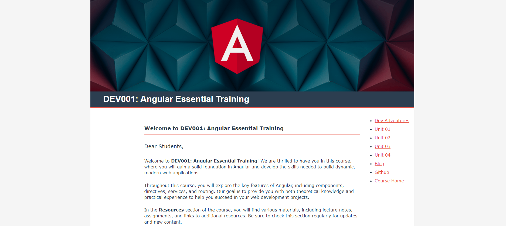
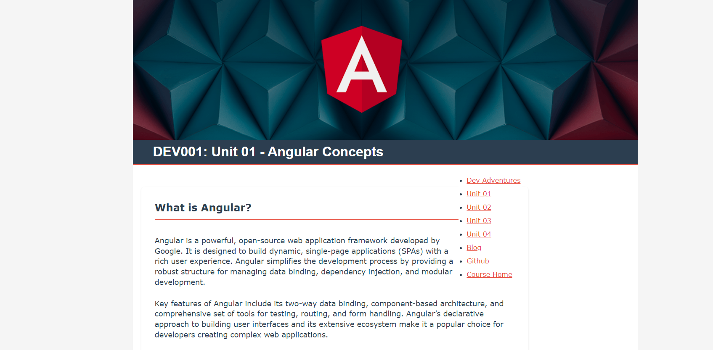
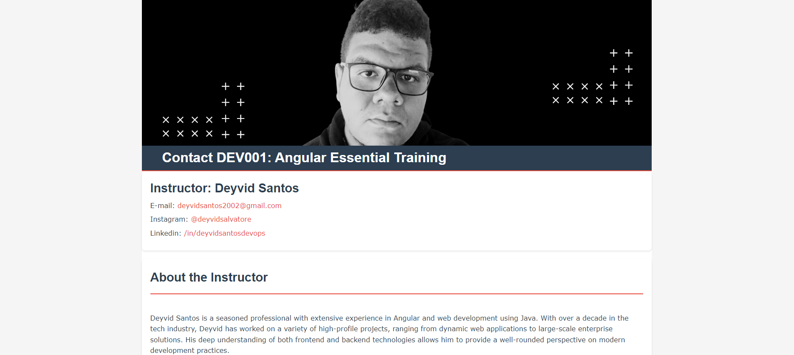

# DEV001: Angular Essential Training Syllabus Website
Welcome to my personal project—a simple and fun syllabus website for the DEV001: Angular Essential Training course!

## Project Overview
This is a playful project where I've created a syllabus website for a hypothetical Angular training course. It's a great example of how you can use HTML and CSS to build a clean, visually appealing site.





## Features
Simple Design: A straightforward, clean design to keep things easy and enjoyable.
Responsive Layout: The website adjusts nicely to different screen sizes.
CSS Styling: Uses custom CSS variables for a consistent look and feel.

## Project Structure
* ```index.html```: The main page of the syllabus website.
* ```_css/styles.css```: The stylesheet that makes everything look nice.
* ```_images/angular_low.png```: The fun header image.
* ```deventures.html```: An extra page I added for fun.
* ```unit01.html, unit02.html, unit03.html, unit04.html```: Pages for different course units.
* ```contact.html```: A contact page for those who want to reach out.

## Contributing
This is just a fun project, so no contributions are necessary, but if you have suggestions or want to add something, feel free to reach out!

## License
This project is for fun and personal use, so there's no formal license. Feel free to use and modify it however you like!

## Contact
If you have any questions or just want to chat about the project, you can reach me at:
LinkedIn: <a href="https://linkedin.com/in/deyvidsantosdevops">/in/deyvidsantosdevops</a>